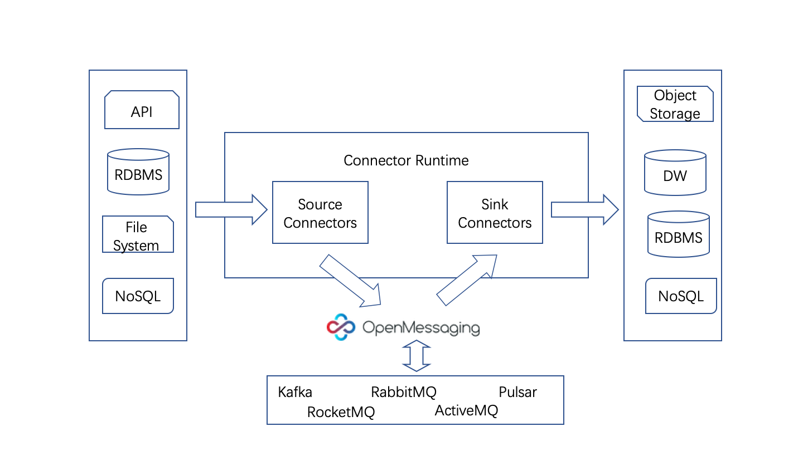

# OpenMessaging Connect

## Introduction
OpenMessaging Connect is a standard to connect between data sources and data destinations. Users could easily create connector instances with configurations via REST API.

There are two types of connectors: source connector and sink connector. A source connector is used for pulling data from a data source (e.g. RDBMS).
The data is sent to corresponding message queue and expected to be consumed by one or many sink connectors.
A sink connector receives message from the queue and loads into a data destination (e.g. data warehouse).
Developers should implement source or sink connector interface to run their specific job.

Usually, connectors rely on a concrete message queue for data transportation. The message queue decouples source connectors from sink connectors.
In the meantime, it provides capabilities such as failover, rate control and one to many data transportation etc.
Some message queues (e.g. Kafka) provide bundled connect frameworks and a various of connectors developed officially or by the community.
However, these frameworks are lack of interoperability, which means a connector developed for Kafka cannot run with 
RabbitMQ without modification and vice versa.

A connector follows OpenMessaging Connect could run with any message queues which support OpenMessaging API.
OpenMessaging Connect provides a standalone runtime which uses OpenMessaging API for sending and consuming message,
as well as the key/value operations for offset management.

## Connector

`void verifyAndSetConfig(KeyValue config)`
 Should invoke before start the connector.

`void start()`
 Start the connector.

`void stop()`
 Stop the connector.

`void pause()`
 Pause the connector.

`void resume()`
 Resume the connector.

`Class<? extends Task> taskClass()`
 Returns the Task implementation for this Connector.

`List<KeyValue> taskConfigs()`
 Returns a set of configurations for Task based on the current configuration.

## Task

`void start(KeyValue config)`
 Start the task with the given config.

`void stop()`
 Stop the task.

`void pause()`
 Pause the task.

`void resume()`
 Resume the task.

### Source task

`Collection<SourceDataEntry> poll()`
 Return a collection of message entries to send.

### Sink task

`void put(Collection<SinkDataEntry> message)`
 Put the data entries to the sink.

## License
